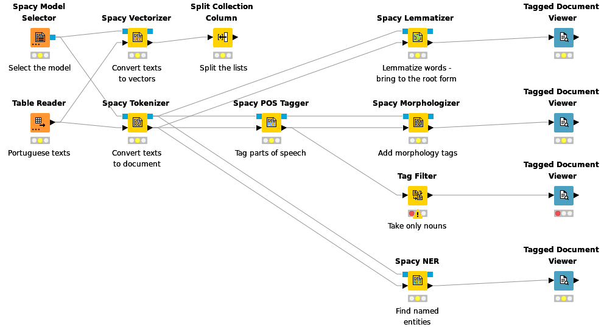

# Redfield NLP Nodes for KNIME

This extension provides nodes that make the functionality of the [spaCy](https://spacy.io/) library available in the [KNIME Analytics Platform](https://www.knime.com/).

SpaCy is an open-source library for advanced NLP that helps you to extract and process data seamlessly using low-code. Among its features are:

 - **Tokenization**: split the document into words, this is an essential task for text processing
 - **Part-of-speech tagging**: search meaningful parts of the sentence
 - **Named Entity Recognition**: extract entities mentioned in the document
 - **Lemmatization**: transform the words to their root form
 - **Morphology analysis**: understand the relationships between subjects, objects and actions in the sentence
 - **Vectorization**: represent words and documents as vectors so it can be used for machine learning

## SpaCy Extension Nodes: Explained

### Spacy Model Selector

**Spacy Model Selector** – initial node that allows to pick the model. The node supports KNIME File Handling framework, so the model can be read from any remote or local source. Custom models are supported, so if the user has his/her own model it is possible to use it – this feature might be interesting for advanced users or researchers.

### Spacy Tokenizer

**Spacy Tokenizer** – the node that converts the String format to Document format, the same as Strings to Document node. The only difference is that it uses the Spacy model.

Example of tokenization:

Sentence: 

`It wasn’t a waste of time if you learned something.`

Tokenized sentence: 

`[“it”, “was”, ”n’t”, “a”, “waste”, “of”, “time”, “if”, “you”, “learned”, “something”, “.”]`

### Spacy POS Tagger

**Spacy POS Tagger** – this node is quite the same as the POS Tagger node in KNIME. The difference is that Spacy models might have their own tags. This might bring some confusion and troubles, however it may give more flexibility for some very specific POS notation for the languages.

### Spacy NER

**Spacy NER** – if the module is available allows to automatically assign NER tags within the document. The tags always depend on the model, so one is interested in what entities can be recognized should check the model description. But in general it is usually person, location, organization. In KNIMEthere are no ready-to-go NER models available, however it is possible to train one – so this might be beneficial for lazy or non-technical people, or people that do not have enough training data.

### Spacy Vectorizer

**Spacy Vectorizer** – converts both Document and String data to the vector (List of Double). This node can be used with data preprocessing, it is optional. In KNIME there is no ready-to-go vectorization model, it is only possible to train your own word2vec model, similar to NER case. Depending on the type of the model it is possible to have vectors based on the transformer model (SOTA). The vectors then can be used for ML, both supervised and unsupervised, and for visualization.

### Spacy Lemmatizer

**Spacy Lemmatizer** – converts words to their root form (lemma). In the current Text processing this feature is only available for English. This method is used for processing the texts before classification and topic modeling.

Explanation example of lemmatization:

    enjoyed -> enjoy
    best -> good
    deliveries -> delivery

### Spacy Morphologizer

**Spacy Morphologizer** – there are no similar nodes in the Text processing extension. The node assigns special tags (similar to POS or NER) that indicate the tense, case, plurality, etc. Might be useful for deep scientific text analysis. Potential use cases: extracting the relationships between entities in the sentence/text, estimation of the frequency of certain words and their forms in the sentence/text. Another scientific use case is the stylometry analysis, where one can try to describe or identify the author by certain words and their forms frequency.

### Spacy Stop Words Filter

**Spacy Stop Words Filter** – removes the words that have no meaning in the sentence using in-built dictionaries. The words like prepositions, conjunctions, articles, etc refer to stop words.

## How To Work With SpaCy: Use Cases

Below, you will find two examples of workflows that show how NLP can be applied in different spheres.

### Workflow #1: Data Extraction From Articles

In the first workflow, we describe the case where we would like to extract the most important terms and topics for business articles to find out what is the current agenda in the financial sector.

Topic modeling is highly effective when it comes to processing customer feedback, whether you want to analyze your customers’ reviews or see how people rate the product of your competitor.

[🔗See Workflow](https://kni.me/w/Wy0UVcJ8jAUBvoMu)

### Workflow #2: Topic Modeling

In the second workflow, to show you more capabilities of the NLP approach, we will use the data set – TV series subtitles. It has the same characteristics as any other unstructured data, so the workflow might be easily tweaked to real use case scenarios (collecting customer reviews, analyzing the review of your competitors, or understanding what is the most discussed in your community).
The whole process consists of the following steps:

1. Prepare a data set.
2. Scrape the data. For this step we used the Selenium extension for KNIME which mimics a human user’s browsing activity.
3. Preprocessing data with Spacy to do topic modeling. Once the data is downloaded, it can be read and meta information is extracted. For data preprocessing we are going to use Tokenizer, POS Tagger, and Lemmatizer nodes. Also, we are going to use Spacy NER node to identify locations, organizations, and person names and then to filter them out so they do not interfere with the topic terms.
4. Topic Modeling And Clustering. This step can be performed via converting the processed texts to vectors and making clustering based on these vectors. Here we need to use the Spacy Vectorizer node.
5. Visualization And Analysis. To make analysis easy and smooth, we can build a dashboard or a knowledge graph.

[🔗See Workflow](https://hub.knime.com/-/spaces/-/~A0nrfQ1GAn2xJ_io/current-state/)